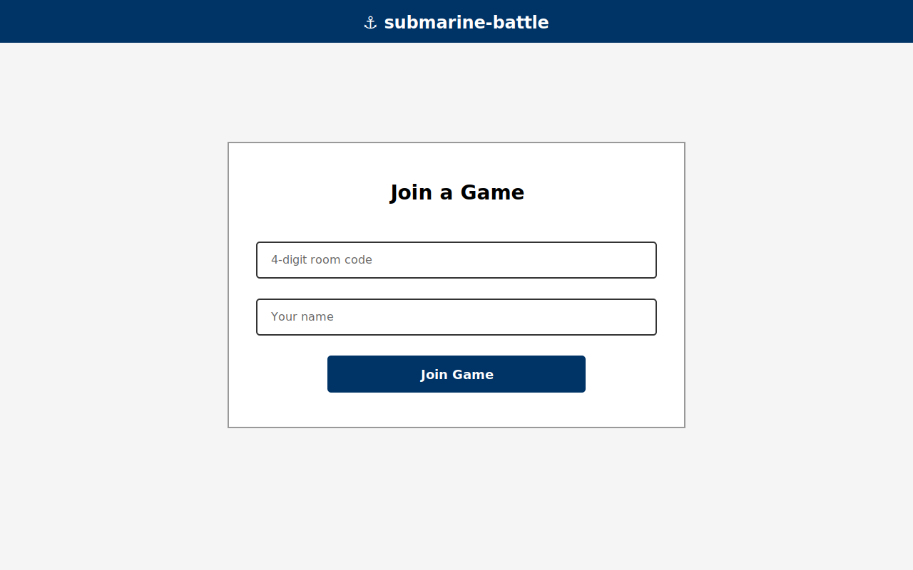
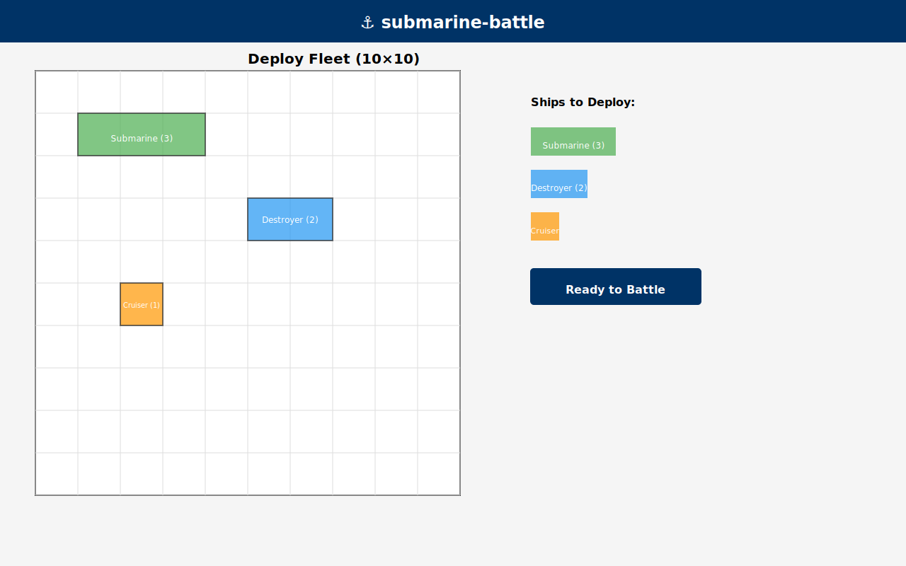
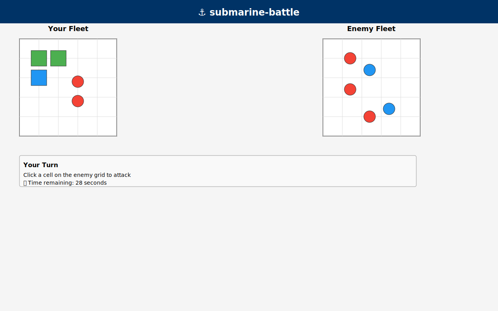

# submarine-battle


> Real-time 2-player naval battle game built with Node.js and Socket.io

Deploy your fleet on a 10×10 grid, hide behind the fog of war, and hunt down your opponent's ships in real time. No sign-up required — just share a 4-digit room code and battle.

## 🏆 Why This Project?

This is the **first complete, runnable reference implementation** for real-time multiplayer games using WebSockets and Node.js:

- **Perfect for game developers** — learn Socket.io patterns with a fully-playable example
- **Ideal for CS students** — understand real-time state synchronization, turn-based logic, and server authority
- **Production-proven** — 55 comprehensive tests covering unit, integration, and edge cases
- **Educational gold standard** — demonstrates proper game state management, client-server communication, and abuse prevention

## ✨ Features

- **Real-time gameplay** over WebSockets (Socket.io)
- **Fog of War** — you only see your own fleet and enemy hits/misses
- **Turn timer** — 30-second limit per turn keeps the game moving
- **In-game chat** with XSS protection and rate limiting
- **Mobile support** with touch-friendly UI
- **Room system** — connect with friends via a 4-digit code
- **Server-side validation** — all game logic runs on the server

## 🚀 Quick Start

```bash
git clone https://github.com/taromaezawa/submarine-battle.git
cd submarine-battle
npm install
npm start
# Open http://localhost:3000 in two browser tabs
```

## ⭐ Why Star This?

**This project is a candidate for OpenAI Codex for OSS** — a program that auto-expands open-source documentation and tests for popular repositories.

- **Target:** 300+ Stars unlocks Codex for OSS program eligibility
- **Impact:** Codex will auto-generate advanced tests (55 → 150+) and comprehensive docs
- **Your help:** Each star brings us closer to educational automation that benefits the entire community

**Your star helps educate the next generation of game developers. Thank you!** 🙏

## 🎮 How to Play

### Step 1: Create or Join a Room

Open the app and enter any 4-digit room code. Share this code with your opponent so they can join the same room.



### Step 2: Deploy Your Fleet

Place your three ships on the 10×10 grid:
- **Submarine** (3 cells) — large ship
- **Destroyer** (2 cells) — medium ship  
- **Cruiser** (1 cell) — small ship

Once both players have deployed their fleets, the game begins.



### Step 3: Battle!

Take turns attacking the enemy grid. Each turn lasts 30 seconds. Red hits indicate a successful strike; blue marks a miss. The first player to sink all three opponent ships wins!



## 🏗️ Architecture

Node.js + Express serves static files and hosts the Socket.io server. All game state lives in memory on the server — the client only renders what the server tells it. No database required for local play.

```
submarine-battle/
├── server/
│   ├── index.js          # Express + Socket.io server, event routing
│   ├── game.js           # GameManager class, all game logic
│   └── rooms.js          # Room management helpers
├── public/
│   ├── index.html        # Room join UI
│   ├── game.html         # Game board UI
│   ├── style.css         # Grid and game styling
│   └── client.js         # Socket.io client, event listeners
├── tests/
│   ├── game.test.js      # Unit tests (36 cases)
│   └── integration.test.js  # Integration tests (19 cases)
├── .github/workflows/
│   └── ci.yml            # GitHub Actions CI (Node 18 & 20)
├── railway.json          # Railway.app deployment config
├── AGENTS.md             # AI coding assistant guide
└── SPEC.md               # Full game specification
```

## 🔌 Socket.io Events

### Client → Server

| Event | Payload | Description |
|-------|---------|-------------|
| `join-room` | `{roomCode, playerName}` | Join or create a room |
| `deploy-fleet` | `{roomCode, grid}` | Submit fleet placement |
| `attack` | `{roomCode, row, col}` | Fire at a coordinate |
| `chat-message` | `{roomCode, playerName, text}` | Send a chat message |

### Server → Client

| Event | Payload | Description |
|-------|---------|-------------|
| `room-joined` | `{roomCode, players}` | Room join confirmed |
| `player-joined` | `{playerName}` | Opponent connected |
| `fleet-deployed` | `{playerId, ready}` | Fleet placement acknowledged |
| `game-start` | — | Both players ready, game begins |
| `attack-result` | `{hit, row, col, gameOver, winner}` | Attack outcome |
| `turn-change` | `{nextPlayer}` | Turn switched |
| `turn-timer` | `{secondsLeft}` | Countdown update |
| `turn-timeout` | `{nextPlayer}` | Turn skipped on timeout |
| `chat-message` | `{playerName, text}` | Broadcast chat message |
| `game-over` | `{winner}` | Game ended |
| `error` | `{message}` | Error response |

## 🧪 Testing

```bash
npm test
```

55 tests across two suites:

- **Unit tests** (`tests/game.test.js`, 36 cases) — fleet validation, hit detection, win condition, GameManager state transitions
- **Integration tests** (`tests/integration.test.js`, 19 cases) — full Socket.io round-trips: room join, fleet deploy, attack sequence, chat, turn timer, disconnect handling

CI runs both suites on Node.js 18 and 20 via GitHub Actions on every push and pull request.

## 🚢 Deployment (Railway)

A `railway.json` is included in the repository. Deploy in three commands:

```bash
railway login
railway init
railway up
```

Railway natively supports persistent WebSocket connections. Vercel is **not** recommended (no persistent WebSocket support).

## 🤖 AI Coding Assistant Support

This project includes [`AGENTS.md`](AGENTS.md) — a navigation guide for AI coding assistants such as OpenAI Codex. It documents the codebase structure, key files, Socket.io event contracts, common task patterns, and a full game-flow diagram. Codex can use this file to onboard instantly and contribute without manual context-setting.

## 🤝 Contributing

This is a **perfect learning resource for WebSocket architecture** and game state synchronization. Community contributions are welcome!

See [CONTRIBUTING.md](CONTRIBUTING.md) for:
- Setup instructions and development workflow
- Code style guidelines
- Pull request process (all contributions must pass `npm test`)
- Ideas for enhancements (animations, leaderboards, AI opponent, etc.)

Have a great idea? Open an issue or submit a PR. We're excited to collaborate!

## 📄 License

MIT © 2024 Taro Maezawa
